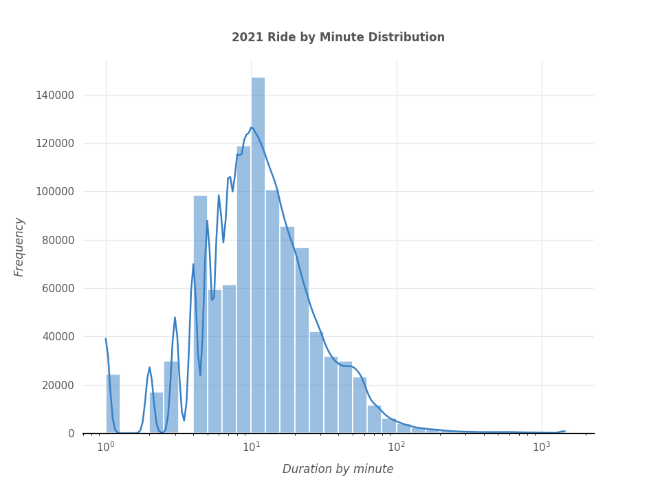
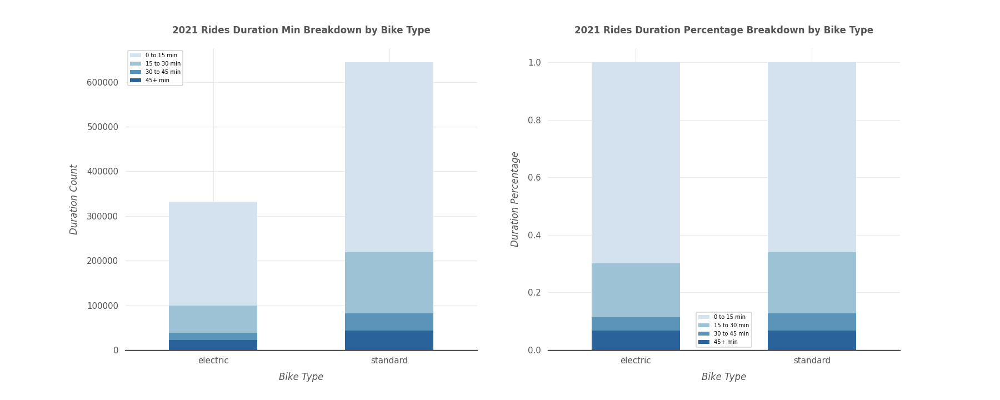
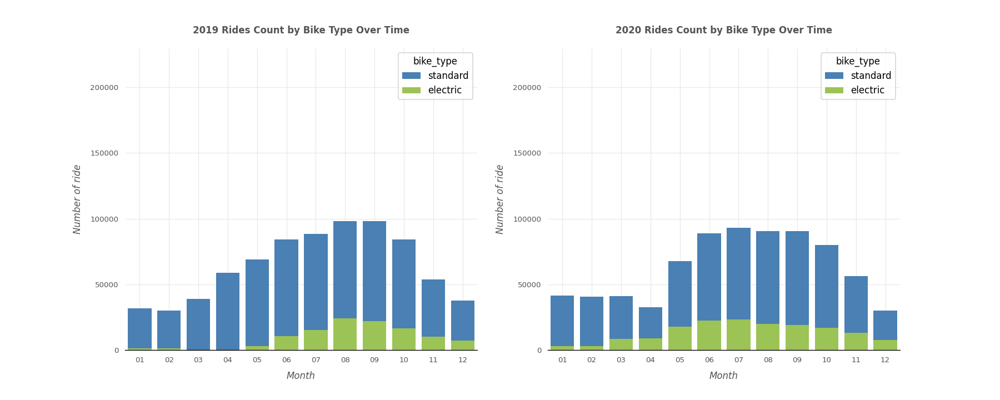
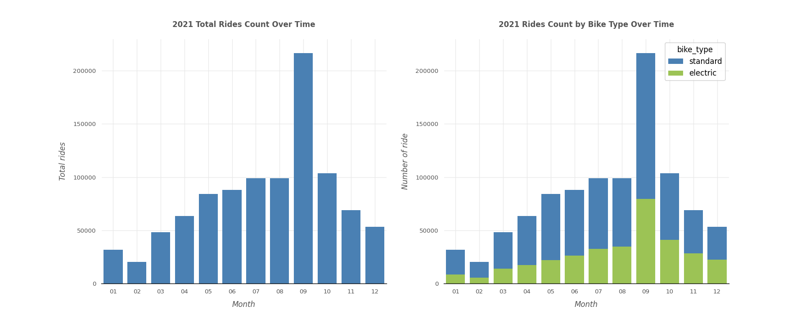
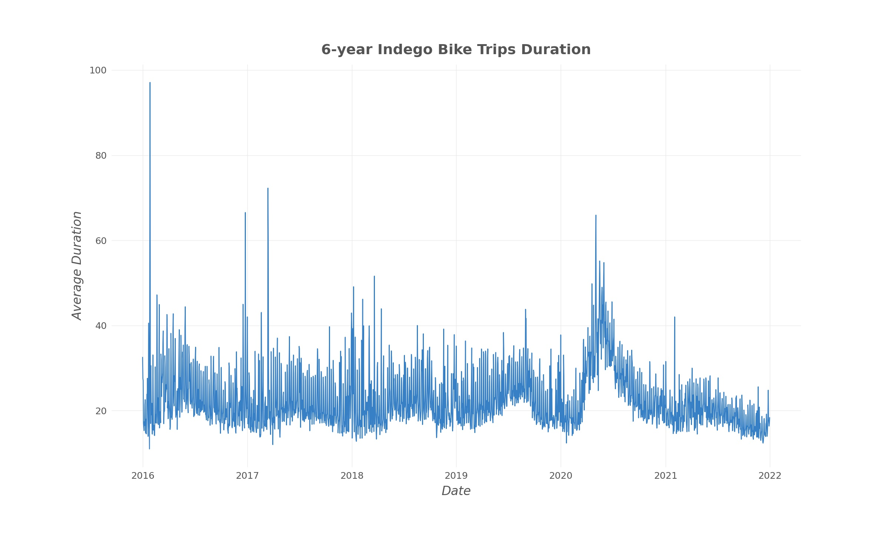
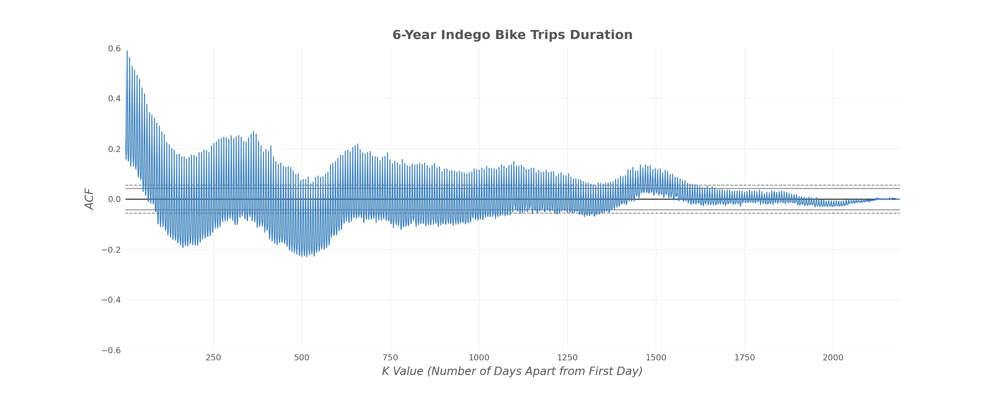
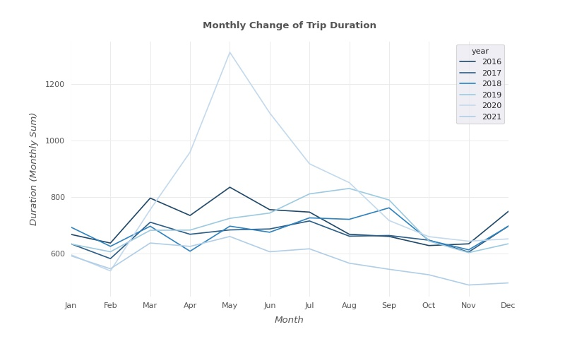
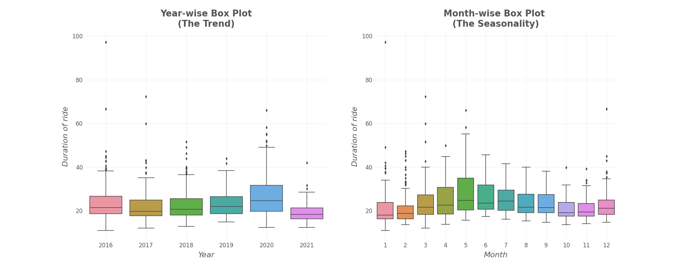

# Indego-shared-bike-project

This is a report version of the analysis, please refer to the python notebook analysis in the file if interested :point_right:[notebook-analysis](https://github.com/Yingtong-Z/YouTube-Trending-Video-Analysis-----US-India-Comparison/blob/8ec8707c171cf576f050d6103fa85d0e665e4b3c/Full-report.pdf)

## 1. Introduction
Philadelphia introduced Indego as the city's newest mode of public transit in 2015. The Office of Transportation and Infrastructure Systems (OTIS) is in charge of planning and managing it. It has provided us with a great deal of convenience over the last few years. However, the initiative is still in its infancy, and there is opportunity for development. During peak hours, for example, users may find themselves without a bike to use or docks to return their bikes. We believe that a study of the usage pattern would be beneficial in helping to improve the service.

In this analysis, we are interested in how long a bike trip will take in general, as well as what factors influence the length of the trip. In our analysis, we have two key points of focus. First, we'll use features such as trip type (whether it's a one-way or round-trip), user type (if the user has a membership), trip start and end times, and weather data to estimate journey duration. Second, we'll utilize time series analysis to predict journey duration in May 2022 based on the average time spent traveling on each day. Indego could utilize the information to improve their service and management if a pattern emerges.

## 2.	Data Preprocessing
In this analysis, the core dataset we will use is the anonymized Indego trip data shared by City of Philadelphia and Bicycle Transit Systems. The data is publicly available on Indego open data website. We used beautifulsoup to crawl 2019 to 2021 Indego trip zip files and read them into csv in python. In 2021 data, there are 976,350 rows of trip records with 15 columns with features such as duration, station, latitude and longitude of the start and end bike station. Entries for 2020 and 2019 are 751,991 and 772,663 respectively. Considering the size and possible similar characteristics of big data by year, we will focus our EDA and modeling on 2021 data with large enough entry. Then we will conduct time series analysis using 3-year data from 2019 to 2021.

To increase the robustness of our data, we combined the core Indego trip data with historical weather data from OpenWeather. In this weather data, we have hourly weather records from the last 5 years with 28 features including temperature, pressure, humidity, wind, rain, snow and so on. We merged the weather data with Indego trip data on the key of start time of a trip. To get more out of our data, we extracted the year, month, hour, day, day of week and day of year from the datetime of start time of a trip.

Due to high memory used for large objects in the big data file, we downcasted the object type to category and also float64 to float32 to optimize the running ram. Memory mb dropped around 80% after downcasting.

## 3.	Exploratory Data Analysis
### 3.1.	Model descriptive statistics (2021) 
The Indego 2021 trip dataset has 976,350 entries and 58 columns and each row indicates a trip with its attributes. A brief info of dataset is given in Table 1. As we can see, the majority of dataset is complete with few Nan values. A few columns with more than 50% missing values will be dropped in the feature engineer section.

Duration, riding minute of a trip, is our main dependent variable and its logarithm distribution is plot with a histogram. It can be inferred that the dataset is slight skewed with outliers but still it falls in a normal distribution with the mean of 18.9. Therefore, the average time for a Indego bike trip in 2021 is around 19 minutes. 

Indego share bike provides two types of biking, including electric and standard bike. We then breakdown duration by bike type and 15 minutes and lower takes up the majority of trip durations both for electric and standard bikes. It can be inferred that overall usage of standard bikes outnumber electric bikes yet there is little difference in usage of duration distribution in terms of bike types.

Indego share bike provides two types of biking, including electric and standard bike. We then breakdown duration by bike type and 15 minutes and lower takes up the majority of trip durations both for electric and standard bikes. It can be inferred that overall usage of standard bikes outnumber electric bikes yet there is little difference in usage of duration distribution in terms of bike types.

  

  

The bar plots below clearly show the seasonal patterns of Indego trip throughout the year. Summer and fall as are peak seasons for people riding bikes while winter and spring enjoy lower ride counts. 

In 2021, there was a peak in number of rides in September when students were back in the city and people back from summer holiday, giving a spur in usage. It is noticeable that both standard and electric bikes have the same seasonal patterns throughout 2021 and in previous years. Compared to previous years, ride counts increased slightly in 2021 and especially in September. Apart from that, electric bikes witnessed a steady increase in usage from 2019 to 2021.

  

  

### 3.2.	Time series exploratory analysis (2016-2021)
Time series analysis can be used to forecast future data based on what we already know. There are four parts in time series data: trend, seasonality, cyclicality, and irregularity. We'll concentrate our investigation on the data's yearly trend and monthly change pattern, and build up ARIMA model for forecasting.

Another thing to note is that we decided to utilize daily average trip duration (for 6 years) instead of data by hour to apply the prediction in time series analysis because we had such a vast dataset and visualization was problematic. 

First, it is important to have our time series staionary to apply ARIMA model. So, at the beginning, we can have a quick look at the stationariy with simple line plot.

  

According to the below plot, the data does not appear to be trending, which means our data is stationary. For the next step, we'll test the autocorrelation to see if this series of data contains seasonality.

The ACF plot shows that autocorrelation has declined from roughly 0.6 to nearly 0 and has a repetitive pattern, indicating that the data has a seasonality.

  

Then, we plot each year as a different line in the same plot, allowing us to compare year-by-year patterns. Although it is not that obvious, we can see that each year, there is more use of the Indego bike in the spring and summer, and less use in the winter, which supports our hypothesis that people are more likely to ride in warm weather. However, the month of May 2020 stands out in this graph, with an extraordinarily high total duration value. We looked for some information and suspect that the incident is tied to an activity that Indego was doing at the time. Indego announced a monthly pass discount with the price $5 on April 23, 2020, to assist individuals going out during the pandemic.

  

Next, we used boxplots to show the data to get a closer look at the yearly trend and seasonality. This set of boxplots show the conclusion of the yearly and monthly changes in total trip duration that we discussed earlier. 

  

## 4.	Feature Engineering
### 4.1.	Feature Selection
As we will build machine learning model with Indego 2021 trip dataset containing over 970,000 entries of data. We will build classification models to predict whether a bike ride is lower than or higher than or equals o average usage duration. We add a predicted variable 'above_average', which transforms the continuous values ‘duration’ into two categories, with 0 denoting a ride is under average and 1 denoting larger or equals to average duration.

Based on our analysis, we will choose the statistical variables that might correlate with trip duration. We will exclude indexing or other variables such as latitude and longitude that have little relation with our predicted variable. Below is the list of features we selected:

['plan_duration','trip_route_category','passholder_type','bike_type','start_time_month','start_time_hour','start_time_day','start_dayOfWeek','start_dayOfYear','temp','visibility','dew_point','feels_like','temp_min','temp_max','pressure','humidity','wind_speed','wind_deg','wind_gust',rain_1h','snow_1h','weather_description']

