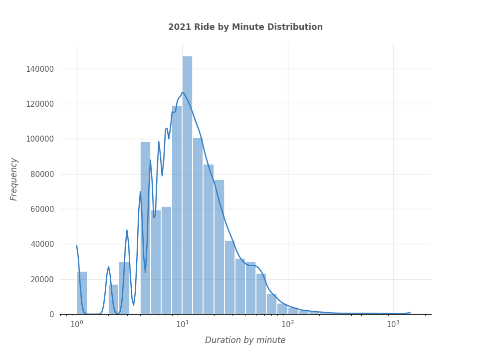
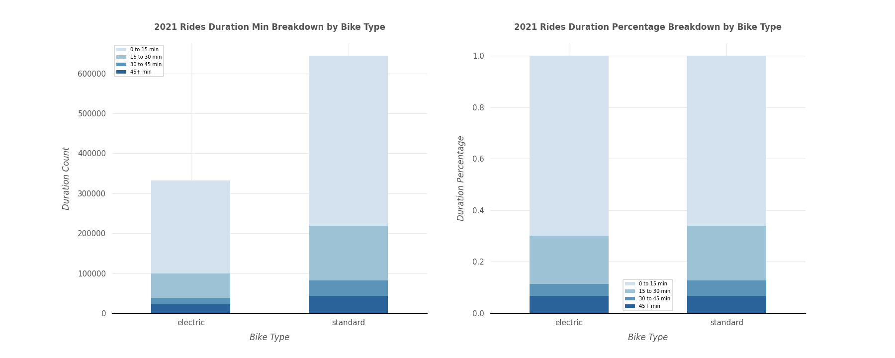

# Indego-shared-bike-project

This is a report version of the analysis, please refer to the python notebook analysis in the file if interested :point_right:[notebook-analysis](https://github.com/Yingtong-Z/YouTube-Trending-Video-Analysis-----US-India-Comparison/blob/8ec8707c171cf576f050d6103fa85d0e665e4b3c/Full-report.pdf)

## 1. Introduction
Philadelphia introduced Indego as the city's newest mode of public transit in 2015. The Office of Transportation and Infrastructure Systems (OTIS) is in charge of planning and managing it. It has provided us with a great deal of convenience over the last few years. However, the initiative is still in its infancy, and there is opportunity for development. During peak hours, for example, users may find themselves without a bike to use or docks to return their bikes. We believe that a study of the usage pattern would be beneficial in helping to improve the service.

In this analysis, we are interested in how long a bike trip will take in general, as well as what factors influence the length of the trip. In our analysis, we have two key points of focus. First, we'll use features such as trip type (whether it's a one-way or round-trip), user type (if the user has a membership), trip start and end times, and weather data to estimate journey duration. Second, we'll utilize time series analysis to predict journey duration in May 2022 based on the average time spent traveling on each day. Indego could utilize the information to improve their service and management if a pattern emerges.

## 2.	Data Preprocessing
In this analysis, the core dataset we will use is the anonymized Indego trip data shared by City of Philadelphia and Bicycle Transit Systems. The data is publicly available on Indego open data website. We used beautifulsoup to crawl 2019 to 2021 Indego trip zip files and read them into csv in python. In 2021 data, there are 976,350 rows of trip records with 15 columns with features such as duration, station, latitude and longitude of the start and end bike station. Entries for 2020 and 2019 are 751,991 and 772,663 respectively. Considering the size and possible similar characteristics of big data by year, we will focus our EDA and modeling on 2021 data with large enough entry. Then we will conduct time series analysis using 3-year data from 2019 to 2021.

To increase the robustness of our data, we combined the core Indego trip data with historical weather data from OpenWeather. In this weather data, we have hourly weather records from the last 5 years with 28 features including temperature, pressure, humidity, wind, rain, snow and so on. We merged the weather data with Indego trip data on the key of start time of a trip. To get more out of our data, we extracted the year, month, hour, day, day of week and day of year from the datetime of start time of a trip.

Due to high memory used for large objects in the big data file, we downcasted the object type to category and also float64 to float32 to optimize the running ram. Memory mb dropped around 80% after downcasting.

## 3.	Exploratory Data Analysis
### 3.1.	Model descriptive statistics (2021) 
The Indego 2021 trip dataset has 976,350 entries and 58 columns and each row indicates a trip with its attributes. A brief info of dataset is given in Table 1. As we can see, the majority of dataset is complete with few Nan values. A few columns with more than 50% missing values will be dropped in the feature engineer section.

Duration, riding minute of a trip, is our main dependent variable and its logarithm distribution is plot with a histogram. It can be inferred that the dataset is slight skewed with outliers but still it falls in a normal distribution with the mean of 18.9. Therefore, the average time for a Indego bike trip in 2021 is around 19 minutes. 

Indego share bike provides two types of biking, including electric and standard bike. We then breakdown duration by bike type and 15 minutes and lower takes up the majority of trip durations both for electric and standard bikes. It can be inferred that overall usage of standard bikes outnumber electric bikes yet there is little difference in usage of duration distribution in terms of bike types.

