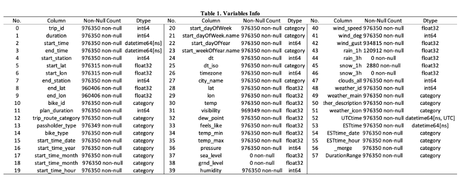

# Indego-shared-bike-project

This is a report version of the analysis, please refer to the python notebook analysis in the file if interested :point_right:[notebook-analysis](Indego_Shared_Bike_Project.ipynb)

## 1. Introduction
Philadelphia introduced Indego as the city's newest mode of public transit in 2015. The Office of Transportation and Infrastructure Systems (OTIS) is in charge of planning and managing it. It has provided us with a great deal of convenience over the last few years. However, the initiative is still in its infancy, and there is opportunity for development. During peak hours, for example, users may find themselves without a bike to use or docks to return their bikes. We believe that a study of the usage pattern would be beneficial in helping to improve the service.

In this analysis, we are interested in how long a bike trip will take in general, as well as what factors influence the length of the trip. In our analysis, we have two key points of focus. First, we'll use features such as trip type (whether it's a one-way or round-trip), user type (if the user has a membership), trip start and end times, and weather data to estimate journey duration. Second, we'll utilize time series analysis to predict journey duration in May 2022 based on the average time spent traveling on each day. Indego could utilize the information to improve their service and management if a pattern emerges.

## 2.	Data Preprocessing
In this analysis, the core dataset we will use is the anonymized Indego trip data shared by City of Philadelphia and Bicycle Transit Systems. The data is publicly available on Indego open data website. We used beautifulsoup to crawl 2019 to 2021 Indego trip zip files and read them into csv in python. In 2021 data, there are 976,350 rows of trip records with 15 columns with features such as duration, station, latitude and longitude of the start and end bike station. Entries for 2020 and 2019 are 751,991 and 772,663 respectively. Considering the size and possible similar characteristics of big data by year, we will focus our EDA and modeling on 2021 data with large enough entry. Then we will conduct time series analysis using 3-year data from 2019 to 2021.

To increase the robustness of our data, we combined the core Indego trip data with historical weather data from OpenWeather. In this weather data, we have hourly weather records from the last 5 years with 28 features including temperature, pressure, humidity, wind, rain, snow and so on. We merged the weather data with Indego trip data on the key of start time of a trip. To get more out of our data, we extracted the year, month, hour, day, day of week and day of year from the datetime of start time of a trip.

Due to high memory used for large objects in the big data file, we downcasted the object type to category and also float64 to float32 to optimize the running ram. Memory mb dropped around 80% after downcasting.

## 3.	Exploratory Data Analysis
### 3.1	Model descriptive statistics (2021) 
The Indego 2021 trip dataset has 976,350 entries and 58 columns and each row indicates a trip with its attributes. A brief info of dataset is given in Table 1. As we can see, the majority of dataset is complete with few Nan values. A few columns with more than 50% missing values will be dropped in the feature engineer section.

Duration, riding minute of a trip, is our main dependent variable and its logarithm distribution is plot with a histogram. It can be inferred that the dataset is slight skewed with outliers but still it falls in a normal distribution with the mean of 18.9. Therefore, the average time for a Indego bike trip in 2021 is around 19 minutes. 

Indego share bike provides two types of biking, including electric and standard bike. We then breakdown duration by bike type and 15 minutes and lower takes up the majority of trip durations both for electric and standard bikes. It can be inferred that overall usage of standard bikes outnumber electric bikes yet there is little difference in usage of duration distribution in terms of bike types.

Indego share bike provides two types of biking, including electric and standard bike. We then breakdown duration by bike type and 15 minutes and lower takes up the majority of trip durations both for electric and standard bikes. It can be inferred that overall usage of standard bikes outnumber electric bikes yet there is little difference in usage of duration distribution in terms of bike types.

  

  

The bar plots below clearly show the seasonal patterns of Indego trip throughout the year. Summer and fall as are peak seasons for people riding bikes while winter and spring enjoy lower ride counts. 

In 2021, there was a peak in number of rides in September when students were back in the city and people back from summer holiday, giving a spur in usage. It is noticeable that both standard and electric bikes have the same seasonal patterns throughout 2021 and in previous years. Compared to previous years, ride counts increased slightly in 2021 and especially in September. Apart from that, electric bikes witnessed a steady increase in usage from 2019 to 2021.

  

  

### 3.2	Time series exploratory analysis (2016-2021)
Time series analysis can be used to forecast future data based on what we already know. There are four parts in time series data: trend, seasonality, cyclicality, and irregularity. We'll concentrate our investigation on the data's yearly trend and monthly change pattern, and build up ARIMA model for forecasting.

Another thing to note is that we decided to utilize daily average trip duration (for 6 years) instead of data by hour to apply the prediction in time series analysis because we had such a vast dataset and visualization was problematic. 

First, it is important to have our time series staionary to apply ARIMA model. So, at the beginning, we can have a quick look at the stationariy with simple line plot.

  

According to the below plot, the data does not appear to be trending, which means our data is stationary. For the next step, we'll test the autocorrelation to see if this series of data contains seasonality.

The ACF plot shows that autocorrelation has declined from roughly 0.6 to nearly 0 and has a repetitive pattern, indicating that the data has a seasonality.

  

Then, we plot each year as a different line in the same plot, allowing us to compare year-by-year patterns. Although it is not that obvious, we can see that each year, there is more use of the Indego bike in the spring and summer, and less use in the winter, which supports our hypothesis that people are more likely to ride in warm weather. However, the month of May 2020 stands out in this graph, with an extraordinarily high total duration value. We looked for some information and suspect that the incident is tied to an activity that Indego was doing at the time. Indego announced a monthly pass discount with the price $5 on April 23, 2020, to assist individuals going out during the pandemic.

  

Next, we used boxplots to show the data to get a closer look at the yearly trend and seasonality. This set of boxplots show the conclusion of the yearly and monthly changes in total trip duration that we discussed earlier. 

  

## 4.	Feature Engineering
### 4.1	Feature Selection
As we will build machine learning model with Indego 2021 trip dataset containing over 970,000 entries of data. We will build classification models to predict whether a bike ride is lower than or higher than or equals o average usage duration. We add a predicted variable 'above_average', which transforms the continuous values ‘duration’ into two categories, with 0 denoting a ride is under average and 1 denoting larger or equals to average duration.

Based on our analysis, we will choose the statistical variables that might correlate with trip duration. We will exclude indexing or other variables such as latitude and longitude that have little relation with our predicted variable. Below is the list of features we selected:

['plan_duration','trip_route_category','passholder_type','bike_type','start_time_month','start_time_hour','start_time_day','start_dayOfWeek','start_dayOfYear','temp','visibility','dew_point','feels_like','temp_min','temp_max','pressure','humidity','wind_speed','wind_deg','wind_gust',rain_1h','snow_1h','weather_description']

## 5.	Classification Models

In this session, we will predict whether a trip will be above average duration or not using classification models. Models will be trained using Apache Spark ML, a powerful distributed machine learning library. The reasons why we chose Spark ML are: 1) we are analyzing "big" data that requires heavy iterative computations on large dataset with around 92,0000 entries of data; 2) standard ML library such as Sklearn are slow in running, especially when running tree models; 3) distribute the computation into multiple machines instead of using one single high-end machine, which is extremely friendly to notebook running in a laptop with less computation capacity.

### 5.1	Model Selections
In terms of model selections, we will first use traditional binary prediction model – logistic regression. The reason why we select logistic model is that it include regularization via L1/L2 penalty. L1/Lasso regularization can perform feature selection by shrinking the unimportant features to zero while L2/Ridge helps prevent overfitting by forcing weights to be small, but not making them exactly 0. The Elastic Net is a combination of L1/L2 regularization that seeks to balance two penalties by giving each a weight. So we will train four logistic models: model without any regularization, model with L1 regularization, model with L2 regularization and model with Elastic Net regularization to see which model performs the best.

Then we also include a random forest tree model, a popular and robust ensemble tree method which work really well with most classification problem, and a Principal Component Analysis (PCA) to reduce the dimensions of the data and fit the lower dimensional data into logistic regression again. 

### 5.2	Hyperparameters Tunning
After training multiple classification models, we found that among the logistic regression models (with and without regularizations), random forest tree model, PCA model, logistic regression models yield better performance compared to others. 
So next step we want to tune the hyperparameters of the logistic regression model to see whether it can improve the performance. For the purpose of hyperparameter tuning we will consider using K-fold validation of 5 folds to tune the following parameters
  -	regParam :[0.01, 0.5, 2.0]
  -	lasticNetParam: [0, 1]

The fixed regularization parameter λ≥0 (regParam in the code) defines the trade-off between the two goals of minimizing the loss (i.e., training error) and minimizing model complexity (i.e., to avoid overfitting). While the 𝛼 defines the weight of L1 and L2 penalty. For alpha = 0, the penalty is an L2 penalty. For alpha = 1, it is an L1 penalty. The objective of hyperparameters tunning is to minimize the loss function where is partly determined by λ and 𝛼. So through tunning, we might find the optimized λ and 𝛼 to minimize the loss function and thus improve model performance.

### 5.3	Model Comparison
Below is the table of all the models trained and fit and the metric AUC used to evaluate model performances. As we can see, logistic regression without regularization performs the best. Surprisingly, random forest tree models does not perform as expected. Though the logistic regression after PCA reduces down the dimensions, it does not improve compared to the original logistic regression model. Moreover, after a 5-fold cross validation of hyperparameters tunning, model performance does not differentiate much. Above all, the final model can be applied would be the Model 1, a logistic regression model without any regularization. The AUC for test data is around 0.56 and that means the model is capable of distinguishing classes of whether a trip is above average duration or not, yet it is not an excellent model.

  

## 6.	Time Series Models (ARIMA)
In this section, we are going to set up ARIMA model with time series data, to provide a method for forecasting trip duration in the future. ARIMA (Autoregressive Integrated Moving Average) is comprised with AR and MA term , and is a common method to predict time series value. But what should be emphasized is that ARIMA need our data to be stationary, which means there should not be a trend in the time series data. So, sometimes we need to deal with the problem by difference the data. 

There are three parameters in an ARIMA model: p, d and q. 
  -	p: the order (number of time lags) of the autoregressive model
  -	d: the degree of differencing 
  -	q: the order of the moving-average model

### 6.1	Finding p, d and q
First, we will determine our d value. Based on our line plot in Part 3.2, we assume that our time series is stationary. To be further confirm the conclusion, we decided to apply ADF test.

  

Table 4 shows the result of ADF test. And we can find that p-value is smaller than significance level of 0.05 and the ADF statistic is lower than 5% critical value. So, we can reject the null hypothesis, which means our time series is stationary, and we can keep d=0.
For p and q, we should initially take the order of AR and MA terms to be equal to as many lags that crosses the significance limit in the PACF/ACF plot. And we used PACF and ACF plot to set the values. 

  

  

We can find that in both plots, lag 1 are quite significant. Also, lag 2 in PACF plot and all lags in ACF are above significance line. As a result, we will initially set p=q=1, build up a (1,0,1) ARIMA model, then make some adjustments according to the result.

### 6.2 Modeling and Tuning
To better fit our data, we finally built three models with different sets of hyperparameter p, d and q. The following table gives us a summary of their basic information.

  

For Model 1, the p-values of the AR1 and MA1 terms are highly significant (< 0.05), which is good. But p-value for MA is very close to 0.05 and it’s not that satisfactory. In Model 2, by adding another 1 order to MA term, we successfully improved the p-values and reduced both AIC and BIC. Then we tried keep adding lags to the model, which is Model 3. However, we find that the p-value for L2 of AR term is not significant, and AIC/BIC is even larger than Model 2. Till now, Model 2, with the hyperparameter of (1,0,2) is the best model of the three. So, we will keep the second model and continue checking its performance.

### 6.2 Models Evaluation

To evaluate the model, we will adopt the following three approaches:
  -	Residuals
  -	Actual vs. Fitted value
  -	Accuracy Metrics

**Residuals**

  

Overall, the residual errors appear to be fine, with a near-zero mean, indicating that the model has a stable performance across time.

**Actual vs. Fitted value**

  

According to the plot，the predicted values match actual value pretty well, also showing the reliability of this model.

**Accuracy Metrics**
Although we seem to have a nice ARIMA model, but what about more concrete evidence for evaluating our model?
Next, we chose three criteria to test the accuracy of the model:
  -	Correlation between the Actual and the Forecast (corr)
  -	Mean Absolute Percentage Error (MAPE)
  -	Root Mean Squared Error (RMSE)
To better show the performance and improvement, we not only test those scores for Model two, but also compare them with values for Model 1.

  

After comparing the two models, we found that Model 1 has a lower MAPE value, which means the model is about 75% accurate in predicting the test set values, while the other one only has an accuracy around 59%. And the first model also has a lower RMSE value. However, Model 2 has a much higher correlation between actual and forecast values, which performs better than Model 1. Overall, the results demonstrate that our model is not that perfect as it seems like, but still, Model 2 is barely satisfactory and acceptable.

## 7.	Summary
In this analysis, we primarily employed classification and time series analysis to forecast the duration of an Indego bike trip. There are a few other things we could do for the next stage to improve our models: 

(1) Introduce Linear Regression Model

  - Since classification models did not perform well as expected, in addition to classification, we could develop linear regression models to predict the ride usage time which is a continuous variable to see whether modeling result can improve.

(2) Apply SARIMA and SARIMAX model for time series

  - In the time series analysis part, our ARIMA model is not that good in predicting future values. The reason may be that our data has a strong seasonality and ARIMA model doesn't deal with it very well. So, we may apply seasonal decomposition and introduce SARIMA/SARIMAX model for next step.

In conclusion, though our results are not perfect, but still meaningful. We hope by further improving our model, it could be used to help Indego better predict the customers’ behavior and provide better service accordingly.
